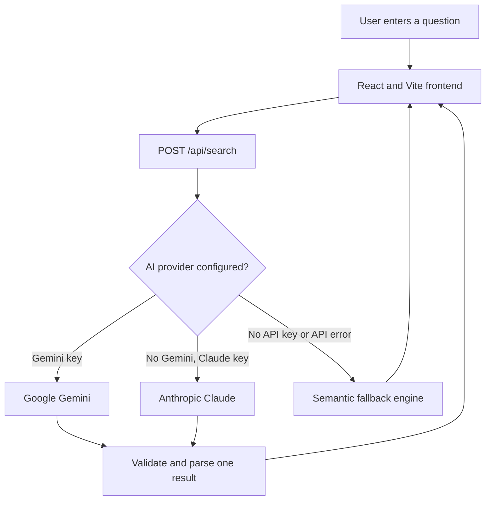

# IDK.exe

## Basic Details

### Team Name: [Add team name]

### Team Members

- Team Lead: Abhishek B - [College]
- Member 2: Vinayak Premil - [College]

### Project Description

IDK.exe is a parody search engine that gives one short, confident, and
intentionally useless answer to any question. Users can choose a personality
and receive a funny response tailored to their exact query.

The React frontend connects to an Express AI backend for live answers and
falls back to a built-in semantic answer engine when the backend or an API key
is unavailable.

### The Problem (that doesn't exist)

People are forced to search the internet for serious answers when what they
really need is a completely unhelpful answer delivered with absolute
confidence.

### The Solution (that nobody asked for)

IDK.exe replaces useful search results with one hilarious parody result. It
uses AI prompts, selectable personalities, and an offline fallback engine to
make sure every question receives an answer, even when nobody asked for one.

## Technical Details

### Technologies/Components Used

For Software:

- Languages: JavaScript, HTML, and CSS
- Frameworks: React 19, Vite, and Express
- Libraries: `@google/genai`, `@anthropic-ai/sdk`, `cors`, and `dotenv`
- Tools: npm, ESLint, and the Vite development proxy

For Hardware:

- No special hardware is required.
- Any computer capable of running Node.js 18 or newer can run the project.

### Implementation

For Software:

# Installation

Install the frontend and backend dependencies:

```bash
npm run setup
```

Create the backend environment file:

```bash
cp server/.env.example server/.env
```

Set `GEMINI_API_KEY` in `server/.env` for live Gemini answers. You can
optionally set `ANTHROPIC_API_KEY` to use Claude when Gemini is unavailable.
No API key is required for the built-in fallback engine.

# Run

Start the frontend and backend together:

```bash
npm run dev:all
```

Open `http://localhost:5173` in a browser. To run the services separately:

```bash
npm run dev      # Frontend on http://localhost:5173
npm run server   # Backend on http://localhost:3001
```

## Project Documentation

For Software:

### Screenshots

> Add at least three screenshots of the running application to the repository
> and replace the placeholders below with their paths.


*The search page with the query field and personality selector.*


*The generated parody result and its humorous verdict.*


*The offline semantic fallback response when no AI provider is available.*

### Diagrams


*The application flow from a user query to an AI-generated or offline result.*

For Hardware:

No hardware schematic, circuit, or build photos are applicable to this
software project.

### Project Demo

# Video

[Add your demo video link here]

*The demo should show the query flow, personality selection, generated result,
and offline fallback behavior.*

# Additional Demos

[Add any extra demo materials or links here]

## Team Contributions

- [Team Lead]: Frontend structure, search interface, and application styling
- [Member 2]: Backend API, AI provider integration, and prompt handling
- [Member 3]: Offline fallback engine, testing, documentation, and demo

---

Made with love at TinkerHub Useless Projects


